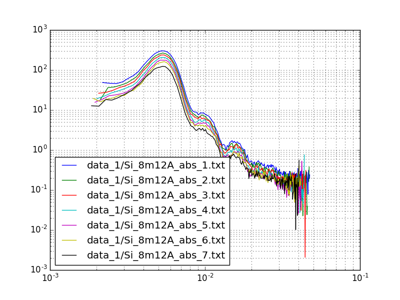
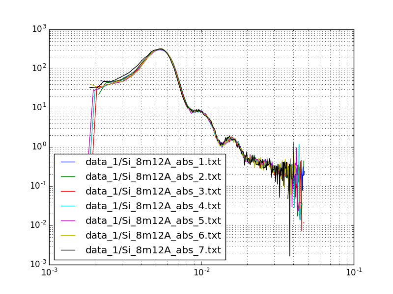
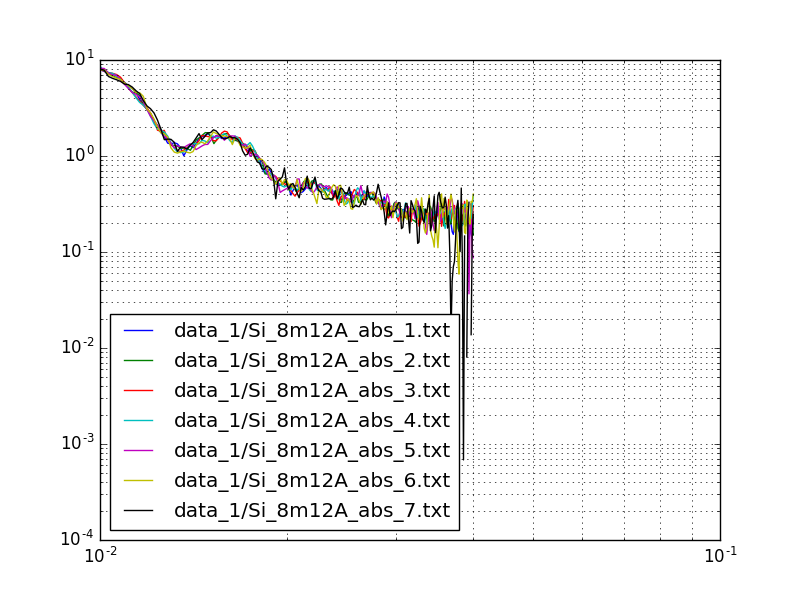

# SANS SuperImpose

Small Angle (Neutron) Scattering superimpose `I(q)` curves.

Given several `I(q)` curves, finds K (scale factor) and b (y-intercept) so all the curves are superimposed.

Equation:
```
I(scaled) = f * I(original) – b
```

**Raw datasets:**




**Fitted datasets:**



**Fitted datasets within `q > 0.01` and `q < 0.04` :**



**Table with the fit results:**

```
File                            K    Err(K)        b    Err(b)
-------------------------  ------  --------  -------  --------
data_1/Si_8m12A_abs_1.txt  0.0000    0.0000   0.0000    0.0000
data_1/Si_8m12A_abs_2.txt  1.2026    0.0606   0.0099    0.0871
data_1/Si_8m12A_abs_3.txt  1.3134    0.0660  -0.0116    0.0863
data_1/Si_8m12A_abs_4.txt  1.4970    0.0753  -0.0335    0.0857
data_1/Si_8m12A_abs_5.txt  1.7412    0.0876  -0.0385    0.0856
data_1/Si_8m12A_abs_6.txt  2.0064    0.1010   0.0537    0.0882
data_1/Si_8m12A_abs_7.txt  2.6015    0.1312   0.1567    0.0913
```

## Dependencies

Needs packages:
- pandas
- scipy
- matplotlib
- numpy
- tabulate

## Customisation

If needed change defaults in ```config.cfg```:
```
[General]
qmin = 0.0001
qmax = 1.0
```

## Help

Type:

```bash
$ ./superimpose.py -h
```

```
usage: superimpose.py [-h] -r REFERENCE -i INPUT [-q QMIN] [-m QMAX]
                      [-g DISCARD_BEGIN] [-e DISCARD_END] [-n]
                      [-k K | --k-list K_LIST [K_LIST ...]]
                      [-b B | --b-list B_LIST [B_LIST ...]]

Calculates: I_{scaled}(Q) = K*I(Q)+b

optional arguments:
  -h, --help            show this help message and exit
  -r REFERENCE, --reference REFERENCE
                        File used as reference to scale all curves
  -i INPUT, --input INPUT
                        Input files (if the reference file is included here it
                        will ignored). Use wildcards, e.g., 'xpto_*'.
  -q QMIN, --qmin QMIN  Q min. If not given, gets it from the config file.
  -m QMAX, --qmax QMAX  Q max. If not given, gets it from the config file.
  -g DISCARD_BEGIN, --discard-begin DISCARD_BEGIN
                        Discard n points from the beginning of every dataset.
  -e DISCARD_END, --discard-end DISCARD_END
                        Discard n points from the end of every dataset.
  -n, --no-save         Do not save the scaled datasets as _scaled.csv.
  -k K                  Default K value for I_{scaled}(Q) = K*I(Q)+b.
  --k-list K_LIST [K_LIST ...]
                        List of K values. Must be the same lenght has data -1
  -b B                  Default b value for I_{scaled}(Q) = K*I(Q)+b.
  --b-list B_LIST [B_LIST ...]
                        List of B values. Must be the same lenght has data -1
```

## Usage Examples

Run as:

```
# standard
python superimpose.py -r data_2/Si_4m6A_abs_1.txt -i 'data_2/Si_4m6A_abs_*' --qmin 0.01 --qmax 0.019

# Discard 5 points of every dataset at the beginning and end
./superimpose.py  -r data_1/Si_8m12A_abs_1.txt -i 'data_1/Si_8m12A_abs_*txt' --qmin 0.01 --qmax 0.04 --discard-begin 5 --discard-end 5

# Do not save csv files. The CSV files are saved to the same folder as the data.
./superimpose.py  -r data_1/Si_8m12A_abs_1.txt -i 'data_1/Si_8m12A_abs_*txt' --qmin 0.01 --qmax 0.04 --no-save

# Forces k to be 0.1
./superimpose.py  -r data_1/Si_8m12A_abs_1.txt -i 'data_1/Si_8m12A_abs_*txt' --qmin 0.01 --qmax 0.04 -k 0.1

# Forces b to be 0.1
./superimpose.py  -r data_1/Si_8m12A_abs_1.txt -i 'data_1/Si_8m12A_abs_*txt' --qmin 0.01 --qmax 0.04 -b 0.1

# Forces b to be a list 0.02 0.02 0.03 0.03 0.05 0.05
./superimpose.py  -r data_1/Si_8m12A_abs_1.txt -i 'data_1/Si_8m12A_abs_*txt' --qmin 0.01 --qmax 0.04 --b-list 0.02 0.02 0.03 0.03 0.05 0.05

# Forces k to be a list
./superimpose.py  -r data_1/Si_8m12A_abs_1.txt -i 'data_1/Si_8m12A_abs_*txt' --qmin 0.01 --qmax 0.04 --k-list 1.0 1.2 1.3 1.5 1.7 2

```

## Instalation

### Best


Update pip and install virtual env:

```
pip install --upgrade pip --user
pip install virtualenv --user
```

Go to the folder where you have the code:
```
cd superimpose/
# create a virtual enviroment and activate it
virtualenv venv
source ./venv/bin/activate
# install dependencies
pip install -r requirements.txt
# test it
./superimpose -h
```

Remember, everytime you need to launch the application you need to activate the virtual environment:

```
cd superimpose/
source ./venv/bin/activate
./superimpose -h
```
### Alternative

If needed, install missing packages with ```pip```:

```
pip install <package name> --user
```

Errors in analysis.ornl.gov:
```
$ ./superimpose.py -r data_2/Si_4m6A_abs_1.txt -i 'data_2/Si_4m6A_abs_*' --qmin 0.009 --qmax 0.019
Traceback (most recent call last):
  File "./superimpose.py", line 22, in <module>
      import pandas as pd
      ImportError: No module named pandas
```

```
$ ./superimpose.py -r data_2/Si_4m6A_abs_1.txt -i 'data_2/Si_4m6A_abs_*' --qmin 0.009 --qmax 0.019
Traceback (most recent call last):
  File "./superimpose.py", line 28, in <module>
      from tabulate import tabulate
      ImportError: No module named tabulate
```

The missing packages should be only these two:
```
pip install pandas tabulate --user
```
